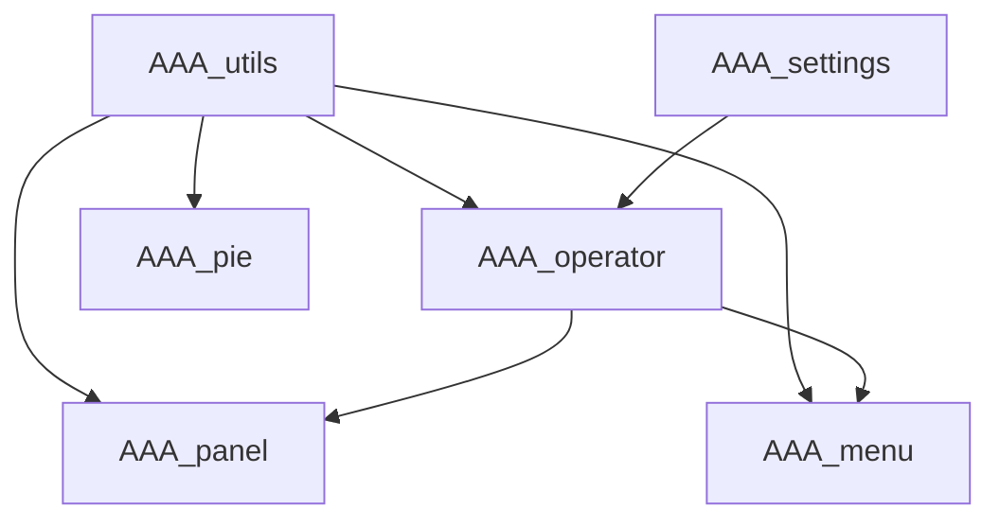

# Refactoring Strategy — AAA_*.py Codebase Audit

## Audit Summary — 7 files, ~2100 lines total

| File | Lines | Role |
|------|-------|------|
| `AAA_utils.py` | 65 | Constants for modes / object types |
| `AAA_settings.py` | 40 | Scene property registration (cleaned) |
| `AAA_operator.py` | 645 | 20 operators (save, transform, overlay toggle, etc.) |
| `AAA_panel.py` | 329 | 7 UI panels (modifiers, proportional edit, frame range, etc.) |
| `AAA_menu.py` | 635 | 21 menus (mode, view, select, tools, modifiers, etc.) |
| `AAA_pie.py` | 261 | 6 pie menus (space, tools, animation, shading, save, conditions) |
| `AAA_keymap.py` | 114 | Global and 3D-View keymap registration |

### Critical Issues — Status

| # | Issue | Status |
|---|-------|--------|
| 1 | **AAA_panel.py — OBJ shadowing**: `VIEW3D_PT_proportional_edit_2.draw()` assigns `OBJ = bpy.context.active_object`, shadowing the global `OBJ = 'OBJECT'` constant. | **False alarm** — `OBJ` local is in a different class scope; no actual bug. |
| 2 | **AAA_keymap.py — unregister() broken**: re-added keymaps instead of removing them. | **FIXED** — now tracks keymaps in `addon_keymaps` list and removes them. |
| 3 | **AAA_operator.py — exec() injection** in `SWITCH_VALUE` and `ToggleProp`. | **ACCEPTED** — see AGENTS.md Exceptions. |
| 4 | **AAA_settings.py — property anti-pattern**: monkey-patched Scene in class body. | **FIXED** — properties now registered/unregistered in `register()`/`unregister()`. |

### Code Quality Issues
- **Import pollution**: `from AAA_utils import *` in 3 files; `from bpy.props import *` in 2 files
- **Dead code**: ~60 lines commented-out across `AAA_panel.py`, `AAA_operator.py`, `AAA_menu.py`
- **Empty bl_label**: Multiple operators/menus with `bl_label = ""` (`VIEW3D_PT_FRAME_RATE`, `VIEW3D_MT_RENDERER`, `RollAxis`, `ModeSet`, etc.)
- **UPPERCASE class names**: `SWITCH_CONDITION`, `SWITCH_VALUE`, `GLOBAL_Q`, `GLOBAL_W`, `GLOBAL_E`, `STDTools` — inconsistent with PascalCase convention
- **Unused imports**: `Menu` in `AAA_operator.py`, `AddPresetBase` in `AAA_operator.py`, unused constants in `AAA_utils.py`
- **Empty stubs**: `AAA_utils.py` `register()`/`unregister()` do nothing
- **No type hints**: Anywhere in the codebase
- **Inconsistent context usage**: Mix of `bpy.context` and `context` parameter

---

## Phased Refactoring Plan

### Phase 1 — Safety & Correctness (no behavioral changes)

**Goal**: Fix bugs and security holes without changing UI or behavior.

- **1.1** ~~Fix `AAA_keymap.py:unregister()`~~ ✅ DONE
- **1.2** ~~Fix `AAA_settings.py` property anti-pattern~~ ✅ DONE
- **1.3** Do **not** touch `exec()` in `SWITCH_VALUE` / `ToggleProp` — see AGENTS.md.
- **1.4** Minor: clean up `AAA_keymap.py` comment block (the enum list) — dead code removal.

### Phase 2 — Remove dead code & clean imports

**Goal**: Reduce noise and eliminate unused code.

- **2.1** Remove all commented-out code blocks across all files (keymap enum block done in Phase 1).
- **2.2** Remove unused imports: `Menu` from `AAA_operator.py`, `AddPresetBase` from `AAA_operator.py`.
- **2.3** Replace `from AAA_utils import *` with explicit imports in `AAA_panel.py`, `AAA_menu.py`, `AAA_pie.py`.
- **2.4** Replace `from bpy.props import *` with explicit imports in `AAA_panel.py`, `AAA_menu.py`.
- **2.5** Prune unused constants from `AAA_utils.py` (GPE, GPS, GPW, GPP, MBE, LCE, PTC, TXE, non-MESH object types).
- **2.6** Delete empty `register()`/`unregister()` stubs from `AAA_utils.py`.

### Phase 3 — Naming & consistency

**Goal**: Consistent, readable naming throughout.

- **3.1** Rename UPPERCASE operator classes to PascalCase:
  - `SWITCH_CONDITION` → `SwitchCondition`
  - `SWITCH_VALUE` → `SwitchValue`
  - `GLOBAL_Q` → `GlobalQ`
  - `GLOBAL_W` → `GlobalW`
  - `GLOBAL_E` → `GlobalE`
  - `STDTools` → `StdTools`
- **3.2** Set meaningful `bl_label` values for operators/menus that currently have empty strings.
- **3.3** Rename `VIEW3D_PT_FRAME_RATE` to proper PascalCase (e.g., `VIEW3D_PT_frame_rate` → `VIEW3D_PT_FrameRate`).

### Phase 4 — Module structure & import hygiene

**Goal**: Clean dependency graph and explicit APIs.

- **4.1** Replace all implicit `AAA_utils` constant references with explicit qualified names if a single-import pattern is desired, or create a `constants.py` module.
- **4.2** Consolidate the `classes` tuple/register/unregister pattern into a shared helper to reduce boilerplate across all 6 registerable modules.
- **4.3** Consider an `__init__.py` that controls load order: `AAA_utils` → `AAA_settings` → `AAA_operator` → `AAA_panel` → `AAA_menu` → `AAA_pie` → `AAA_keymap`.

### Phase 5 — Type hints & documentation

**Goal**: Improve maintainability with type annotations.

- **5.1** Add type hints to all operator `execute()` methods, panel `draw()` methods, and utility functions.
- **5.2** Add descriptive docstrings to every operator class explaining what it does and which key/pie triggers it.
- **5.3** Replace vague commit messages (many "quicksave" commits in history) with an established pattern going forward.

---

## Dependency / Load Order

Phases **must** be executed sequentially — each builds on the previous.
